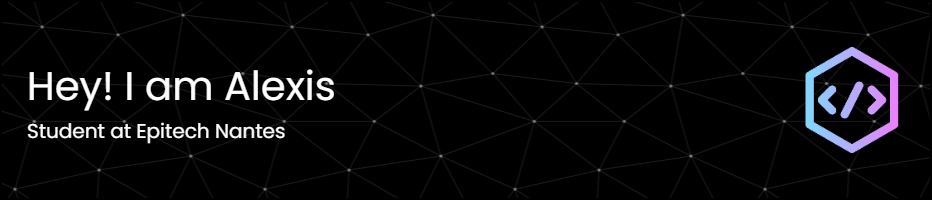

<h2 align="left">More about Me:</h2>

###

🎓 2nd-year student at Epitech | Passionate about tech, coding, and innovation 🤖 Exploring robotics, AI, and holographic technologies 🔧 Next goal: building a rotating hologram using Arduino 🚀 Always ready for new challenges and creative projects

###

  
  
  
  
  
  
  
  
  
  
  
  
  
  
  
  
  
  
  
  
  
  
  

###

  
  
  

###

 

<picture>
  <source media="(prefers-color-scheme: dark)" srcset="https://raw.githubusercontent.com/alexisheraud/alexisheraud/output/github-snake-dark.svg" />
  <source media="(prefers-color-scheme: light)" srcset="https://raw.githubusercontent.com/alexisheraud/alexisheraud/output/github-snake.svg" />
  
</picture>

###
